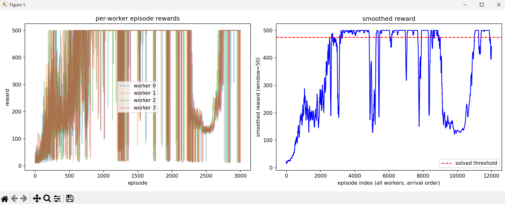

# Implementing-Asynchronous-Advantange-Actor-Critic-A3C
# A3C on CartPole-v1 (from scratch)

This is my own try at building A3C (Asynchronous Advantage Actor-Critic) using PyTorch. I made it to learn how A3C works, so the code is kept simple and easy to read.

## What is A3C?

A3C is a reinforcement learning method. It runs many "workers" at the same time. Each worker plays the game on its own and sends its gradients to one shared (global) network. This way training is faster, and the workers exploring different things helps keep training more stable.

## How it works (short version)

- There is one shared network (`global_net`). Each worker has its own copy of it (`local_net`).
- Each worker plays the game, collects 10 steps of experience (`N_STEPS`), then computes gradients and updates the shared network.
- The network has two heads: an **actor** (picks the action) and a **critic** (guesses how good the state is).
- Loss = actor loss + 0.5 * critic loss (critic loss uses MSE).

## Settings used

| Setting | Value |
|---|---|
| Workers | 4 |
| Hidden layer size | 128 |
| Learning rate | 3e-4 |
| Gamma (discount) | 0.99 |
| N-steps | 10 |
| Max episodes per worker | 3000 |

## How to run

```bash
pip install torch gymnasium matplotlib numpy
python A3C_on_CartPole-v1_from_scratch.py
```

## Results

Training ran about 12,000 episodes total (4 workers x 3000 each). Left plot is reward per episode for each worker. Right plot is the smoothed reward over time, red dashed line is the "solved" score (475).


This is my own try at building A3C (Asynchronous Advantage Actor-Critic) using PyTorch. I made it to learn how A3C works, so the code is kept simple and easy to read.

## What is A3C?

A3C is a reinforcement learning method. It runs many "workers" at the same time. Each worker plays the game on its own and sends its gradients to one shared (global) network. This way training is faster, and the workers exploring different things helps keep training more stable.

## How it works (short version)

- There is one shared network (`global_net`). Each worker has its own copy of it (`local_net`).
- Each worker plays the game, collects 10 steps of experience (`N_STEPS`), then computes gradients and updates the shared network.
- The network has two heads: an **actor** (picks the action) and a **critic** (guesses how good the state is).
- Loss = actor loss + 0.5 * critic loss (critic loss uses MSE).

## Settings used

| Setting | Value |
|---|---|
| Workers | 4 |
| Hidden layer size | 128 |
| Learning rate | 3e-4 |
| Gamma (discount) | 0.99 |
| N-steps | 10 |
| Max episodes per worker | 3000 |

## How to run

```bash
pip install torch gymnasium matplotlib numpy
python A3C_on_CartPole-v1_from_scratch.py
```

## Results

Training ran about 12,000 episodes total (4 workers x 3000 each). Left plot is reward per episode for each worker. Right plot is the smoothed reward over time, red dashed line is the "solved" score (475).



The agent learns pretty fast at first and crosses the solved line a few times. But it is not stable — reward drops back down a few times before going up again. This is a common problem with A3C, since the workers can pull the shared network in different directions, and there is no entropy bonus here to keep the policy exploring.)

The agent learns pretty fast at first and crosses the solved line a few times. But it is not stable — reward drops back down a few times before going up again. This is a common problem with A3C, since the workers can pull the shared network in different directions, and there is no entropy bonus here to keep the policy exploring.

## Things I want to try next

- Add an entropy bonus so the policy does not get too sure of itself too early
- Add gradient clipping
- Try a smaller learning rate or a learning rate schedule
- Save the best model instead of just the last one
